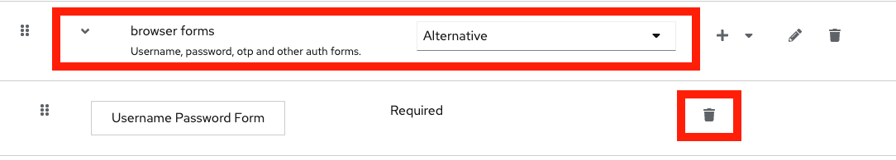

# Keycloak Email TOTP Authenticator

This authenticator allows for user authentication via an emailed TOTP. It's
based off of the work done [here]( https://github.com/dasniko/keycloak-2fa-sms-authenticator)
and [here](https://gitlab.com/niroj.adhikary/keycloak-email-otp/-/tree/master).

## Dev Setup

Clone the project:

```sh
git clone git@github.com:5-stones/keycloak-email-otp.git
cd keycloak-email-otp
```

Build the project:

```sh
mvn clean install
```

The prior command should generate a `.jar` file at the following location:

```sh
./target/com.weare5stones.keycloak.authenticators.emailotp-keycloak-authenticators-emailotp-[VERSION_NUMBER].jar
```

This file should be copied into the `/providers` directory of your keycloak
server. If you're using the `quay.io/keycloak/keycloak` distribution that would
be `/opt/keycloak/providers`.

After placing the plugin in the `providers` directory you'll need to restart
Keycloak.

## Installation & Configuration

As detailed in the [dev setup](#dev-setup) section, you can manually build and
install this plugin.

However we build, create, and store an artifact of each release in this github
account. If you don't want to manually build you can install our artifact by
doing something like the following:

```sh
export VERSION=some_version
wget "https://github.com/5-stones/keycloak-email-otp/releases/download/v$VERSION/com.weare5stones.keycloak.authenticators.emailotp-keycloak-authenticators-emailotp-$VERSION.jar"
```

Once installed you'll need to add the authenticator to an Authentication flow
by selecting the `Email TOTP Authentication` step. Once added don't forget
to configure it, at a minimum you'll need to specify an "Alias". See some example
configuration below:


## Example Usage

We use this plugin to migrate users from other platforms into Keycloak.
Specifically when no password hashes or related data can be extracted from that
platform. Instead of emailing all the newly imported users and pushing them
through the password reset flow, you can build an "Authentication Flow" that
will log the user in via a TOTP code sent to their email the first time they
login to keycloak and prompt them to set a password. After that they'll be able
to login with a username and password as is typical. Below is an instructions
on how to setup such a flow.

#### 1. Duplicate the Default "browser" flow

Go to the `Authentication` section for your realm and make a copy of the
default/built-in "browser" flow. Name it something like "browser email otp".


#### 2. Replace The Username Password Form

Edit the new flow and delete the "Username Password Form" in the "browser forms"
sub-flow:



We'll now add the following to the "browser forms" flow:

1. The "Username Form"
	- This step should be "Required"
2. A Generic "sub-flow" named something like "browser email password/otp auth"
	- This step should be "Required"

To the newly created subflow we'll add two "Alternative" steps:

1. "Passord Form"
2. "Email TOTP Authentication"

The final modifications should look like the following:


#### 3. Finishing Up

Finally you need to bind your newly created Authentication flow to the "Browser Flow".

Once in place, if you have **a user that has no password configured** upon
entering their username they'll be sent an email with the TOTP code and
taken to a form that prompts them to enter that code to finish their login. Once
they enter that code they'll be successfully logged in.

If you also want the user to adopt a password in the new system you can flag
that user or set of users with the "Required User Action" of "Update Password".
Doing so will immediately prompt the user to set a new password the first time
they login with this TOTP method.

## Release
